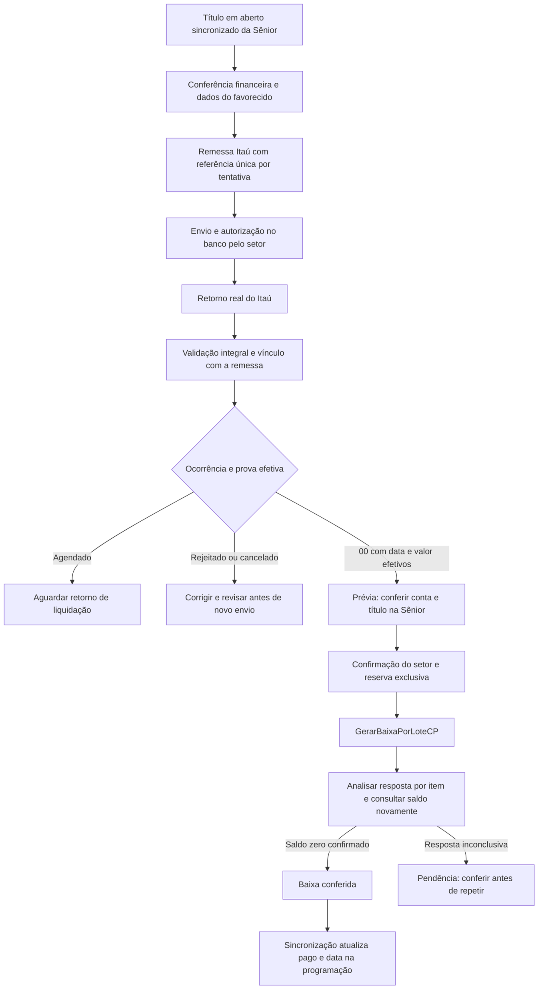

# Auditoria financeira e homologação local — 08/10/2026

> **Evolução em 09/10/2026:** consulte [o fluxo implementado de retorno e baixa Sênior](fluxo-retorno-itau-baixa-senior.md). O resumo do retorno agora é persistente e a programação é atualizada imediatamente após leitura efetiva da liquidação na Sênior. A indicação de aguardar sincronização nas seções abaixo descreve a etapa anterior. A validação real continua pendente.

## Conclusão

O fluxo existente tinha falhas que impediam considerá-lo validado: o retorno era interpretado sem conferir a estrutura completa, o vínculo com remessas podia ser ambíguo, agendamentos podiam carregar valores tratados como prova de pagamento e a resposta geral do SOAP podia ocultar um erro individual. Repetições e concorrência também não tinham proteção suficiente.

As correções descritas abaixo estão implementadas na branch local `codex/auditoria-pagamentos-itau`, com esquema aplicado exclusivamente à base `consominas_gestao_itau_homologacao`. Foram aprovados 34 testes de biblioteca/integração e 13 cenários HTTP com autenticação real e Sênior simulada. Isso demonstra o comportamento local do código nos cenários testados; a homologação bancária e contábil real continua pendente.

Por orientação do usuário, não foram executadas baixas na Sênior de produção. Ainda não há um par real de remessa e retorno disponibilizado para esta auditoria. Nenhum arquivo foi enviado ao Itaú, nenhuma publicação foi feita e a base original do sistema não recebeu as alterações de esquema.

## Material e escopo analisados

- Documentação do repositório: `README.md`, `Projeto financeiro.md`, `docs/integracao-itau.md` e `scripts/README.md`.
- Registro de descoberta `senior-descobrir-saida.txt`, tratado como evidência histórica de consulta, não como conferência atual dos títulos.
- Esquema Prisma, autenticação, configuração e inicialização do app; programação de pagamento; cadastros e conferência financeira; geração, download e importação Itaú; integração SOAP e sincronização dos títulos.
- Manual local Itaú **SISPAG CNAB240, versão 086, fevereiro de 2024**, incluindo headers, Segmentos A/B/J/J-52, trailers, sequências, ocorrências e campos efetivos. Caminho: `C:\Users\gabriel.furst\Downloads\Layout-de-Arquivos_CNAB-Versa-o-086_SISPAG.pdf`.
- [Contrato e documentação oficial de títulos a pagar da Sênior](https://documentacao.senior.com.br/goup/5.10.3/webservices/com_senior_g5_co_mfi_cpa_titulos.htm), especialmente `GerarBaixaPorLoteCP`, `gridTitulosBaixar`, `numInt` e `gridRetorno/msgErr`.
- [Documentação oficial do pagamento eletrônico nativo da Sênior](https://documentacao.senior.com.br/goup/5.10.4/manual-processos/definicoes-gerais/financas/gestao-de-contas-pagar/leiaute-de-exportacao-importacao-para-remessa-retorno-pagamento-eletronico.htm).
- WSDL e XSD publicados pelo endpoint do ambiente informado nas configurações existentes: ambos responderam HTTP 200 em consulta de metadados sem autenticação. A operação e seus tipos foram conferidos, inclusive ordem dos campos, valores monetários como string e identificação dos erros por item. Cópias locais ignoradas pelo Git estão em `tmp/homologacao/contrato-senior.wsdl` e `.xsd`.

Essa consulta de contrato não comprova permissão do usuário para baixar títulos, configuração da conta/transações ou resultado contábil. O serviço externo de sincronização e sua infraestrutura não foram alterados; o teste HTTP exercitou o endpoint de sincronização do app.

## Fluxo definido para remessa gerada fora da Sênior



O retorno do banco informa o resultado do pagamento. O SOAP registra a baixa do título na Sênior. A Programação de Pagamento continua refletindo a situação sincronizada do ERP: importar um retorno não força o título a ficar pago no espelho.

Mudar a extensão de um retorno para `.REM` apenas disponibiliza uma cópia. Não converte o layout nem comprova que a F510PRT aceitará um arquivo de uma remessa criada fora do ERP. A documentação da integração nativa tem regras próprias de referência, portador e cadastro. O caminho implementado para remessas externas é a baixa por web service após conferência do retorno; não se deve baixar o mesmo pagamento por esse caminho e também pela importação nativa.

## Falhas encontradas e correções implementadas

| Prioridade | Problema encontrado | Comportamento após a alteração |
|---|---|---|
| Alta | Arquivo de remessa ou retorno incompleto podia ser interpretado sem conferência integral | Exige banco 341, header de retorno, registros ASCII de 240 bytes, datas e números válidos, fechamento dos lotes e contagens de trailers. Erros impedem a importação. |
| Alta | A ordem das ocorrências podia determinar indevidamente o status | Avalia o conjunto dos códigos. Agendamento não prova liquidação; `00` exige data/valor efetivos; confirmação com erro/cancelamento é bloqueada; código desconhecido ou devolução exige conferência. |
| Alta | Agendamento podia manter data/valor usados como prova efetiva | Apenas `PAGO` guarda data e valor efetivados e fica elegível à baixa. `BD` e `BE` permanecem agendamentos; `SS` é cancelamento. |
| Alta | A referência no formato de título Sênior se repete em novas tentativas | Novas remessas usam referência interna única por tentativa. O legado permanece legível, mas ambiguidade é bloqueada. Conta de débito, forma, favorecido, destino e boleto são comparados quando disponíveis. |
| Alta | Dois pedidos simultâneos podiam gerar/enviar o mesmo pagamento | Geração verifica pagamentos ativos em transação com trava. A baixa reserva cada item e também protege o título entre remessas históricas. |
| Alta | Reimportação podia repetir o histórico ou alterar parcialmente o lote | SHA-256 normalizado, trava e transação tornam a reimportação idempotente. Uma falha em item reconhecido desfaz as alterações e o registro da importação. |
| Alta | Um retorno posterior podia regredir um pagamento já confirmado | Pagamento `PAGO` não volta a agendado/rejeitado/cancelado; confirmação com valor/data divergente exige conferência. Devolução não provoca estorno automático. |
| Alta | SOAP geral `OK` podia esconder erro individual | Lê `gridRetorno/msgErr` por `numInt`, considera erro de transporte/HTTP e não marca o item recusado como enviado. |
| Alta | Aceite SOAP podia ser confundido com liquidação | Após resposta sem erro, consulta novamente o título. Só conclui com saldo zero e situação admitida; aceite sem liquidação fica `INDETERMINADO`. |
| Alta | Ausência de resposta podia permitir uma nova baixa automática | `EM_PROCESSAMENTO`/`INDETERMINADO` bloqueiam reenvio. Nova conferência pode reconhecer que a Sênior já liquidou; título ainda aberto exige investigação antes de liberar nova tentativa. |
| Alta | Saldo ausente ou inválido podia virar zero | Saldo inválido e resultado de consulta ambíguo são recusados. Identificadores longos são rejeitados antes do SOAP, sem truncar a chave do título. |
| Média | Campos Unicode e soma decimal podiam prejudicar o arquivo | Campos alfanuméricos são normalizados para ASCII; NaN e valores inválidos são rejeitados; totais monetários acumulam centavos inteiros. |
| Média | Erro no Segmento B do PIX podia ser ignorado | Ocorrências complementares participam da decisão do pagamento; J-52 é associado ao boleto e confere o documento do favorecido. |
| Média | Rejeição podia deixar a revisão como enviada indefinidamente | Limpa a marca automática se não houver outro pagamento ativo; preserva correções/revisões manuais. Título cancelado e pagamento ativo bloqueiam nova geração. |
| Média | Sincronização incremental da liquidação não atualizava a data de pagamento | Atualiza também `dataPagamento` no título já existente. |
| Média | Download `.REM` sugeria compatibilidade garantida com importação nativa | Interface e comentários agora identificam uma cópia do retorno e deixam explícita a necessidade de homologar o caminho nativo separadamente. |
| Média | Pendências de envio precisavam ser distinguidas de uma baixa concluída | Remessas e histórico destacam “baixa a conferir” para envio em processamento ou inconclusivo, além do erro de baixa. |

## Base de testes preparada

| Componente | Configuração |
|---|---|
| Banco PostgreSQL | `localhost:5432/consominas_gestao_itau_homologacao` |
| App local | `http://localhost:3001` |
| SOAP simulado | `http://127.0.0.1:3099`, leitura `/leitura` e escrita `/baixa` |
| Usuário do app | `homologacao@consominas.local` — administrador exclusivo da homologação |
| Senha e segredos locais | Arquivo `.env.homologacao`, ignorado pelo Git; senha gerada aleatoriamente |
| Dados iniciais | Uma conta fictícia, quatro títulos de R$ 100,00 e formas de pagamento de teste |
| Arquivos/cache | `uploads-homologacao/` e `.next-homologacao/`, separados da configuração padrão |
| Identificação visual | Faixa amarela de homologação em todas as páginas |

O preparo cria a base separada e aplica nela o esquema. Não clona títulos ou usuários financeiros reais e não copia credenciais reais da Sênior. É reutilizável sem apagar histórico da base de testes. O simulador mantém a liquidação em memória; reiniciá-lo limpa seu estado simulado, sem alterar títulos já gravados no app. Para repetir o ciclo, use novos títulos de teste ou a suíte automatizada, que cria e remove seus próprios registros.

Os comandos devem ser executados na raiz do projeto, com as dependências instaladas e PostgreSQL local disponível:

```powershell
npm run homologacao:preparar
```

Em dois terminais separados, para uso manual:

```powershell
npm run homologacao:senior
```

```powershell
npm run homologacao:dev
```

Para verificar bibliotecas e integração com a base local:

```powershell
npm run test:financeiro
```

Para a suíte HTTP, mantenha o app em execução, mas encerre o simulador manual da porta 3099: a suíte abre seu próprio simulador, executa os cenários e o encerra.

```powershell
npm run test:financeiro:http
```

Para compilar, encerre o app de desenvolvimento antes de executar, pois ambos usam o cache de homologação:

```powershell
npm run homologacao:build
```

Após compilar, `npm run homologacao:start` serve essa versão compilada na mesma porta 3001, como alternativa ao modo de desenvolvimento. Esta foi a versão utilizada na verificação HTTP final e deixada em execução ao término da análise.

## Evidência de validação

| Verificação | Resultado |
|---|---|
| 34 testes de biblioteca e integração | Aprovados: seis formas 01/41/43/45/30/31, PIX, boleto, estrutura, datas, campos, totalizadores, ocorrências, rollback, referência legada, favorecido, idempotência, concorrência e SOAP. |
| 13 cenários HTTP | Aprovados: autenticação, login, simulação sem persistência, geração concorrente, agendamento sem prova, retorno confirmado, duplicidade, prévia sem escrita, baixa concorrente, erro individual, transporte inconclusivo, aceite sem liquidação, boleto completo e sincronização incremental. |
| Compilação Next.js da homologação | Aprovada, incluindo verificação de tipos e geração das 90 páginas. |
| Contrato WSDL/XSD real | Disponível e operação/tipos conferidos por consulta de metadados HTTP 200; não houve escrita no ERP. |
| Separação dos ambientes | Preparação confirmou explicitamente o banco de homologação; as suítes recusam configuração fora da base/serviços locais esperados. |

Os 13 cenários HTTP usam o login real do app, rotas reais do Next.js, PostgreSQL local e um servidor SOAP falso. O resultado está em `tmp/homologacao/resultado-http.json`. Eles não comprovam que o usuário real do ERP tenha permissões ou que as transações contábeis estejam parametrizadas corretamente.

## Pendências para homologação real

1. Disponibilizar um arquivo gerado no fluxo atual e o retorno correspondente, com situação e valor esperados para cada pagamento. Conferir também casos agendados, rejeitados e liquidados, e particularidades de PIX/boleto presentes no contrato do Itaú.
2. Identificar no ERP o título correto por empresa, filial, fornecedor, número e tipo; confirmar conta interna `numCco`, conta bancária, data de baixa, transações e permissões do usuário de integração. O código atual utiliza empresa padrão 1 e transações `90550`/`90650`; a documentação de contrato não valida essa parametrização de negócio.
3. Reproduzir a importação na base de testes do app. Arquivos históricos com referência legada repetida podem exigir conferência manual; não há migração automática que adivinhe qual tentativa foi paga.
4. Fazer a prévia de leitura contra a Sênior de produção, conforme a etapa futura solicitada pelo usuário. Essa mudança de endpoint/credenciais não foi feita nesta entrega.
5. Selecionar um pagamento real já confirmado pelo banco e autorizado pelo setor para uma baixa supervisionada. Conferir antes a ausência de baixa; após o SOAP, verificar título, movimento de contas a pagar, movimento de Tesouraria, conta, transação, valor e data. A consulta automática atual confirma saldo do título, não audita todo o movimento contábil.
6. Validar a sincronização executada pelo processo externo até o título sair da programação em aberto com data correta. Em falha de rede, conferir o que foi efetivamente gravado antes de qualquer nova tentativa.

Descontos, juros, multas, pagamentos parciais, devoluções e estornos não são baixados automaticamente quando houver divergência: exigem decisão contábil. O processamento implementado cobre fornecedores nos segmentos/formas indicados; outros produtos/layouts não devem ser inferidos a partir dele. DDA e conciliação de extrato têm modelos preparatórios, mas não foram homologados nem implementados como integração completa nesta entrega. O formato numérico retornado pelo `GetDBInfo`, a data efetiva no retorno J e detalhes do convênio Itaú precisam ser conferidos no material real.

As alterações ainda são locais. A aplicação do esquema e a publicação em produção dependem da validação funcional dessa base e do teste real posterior. O campo novo `RetornoPagamentoArquivo.hashArquivo` é opcional para manter registros históricos; a criação de seu índice único está aplicada apenas na homologação.
